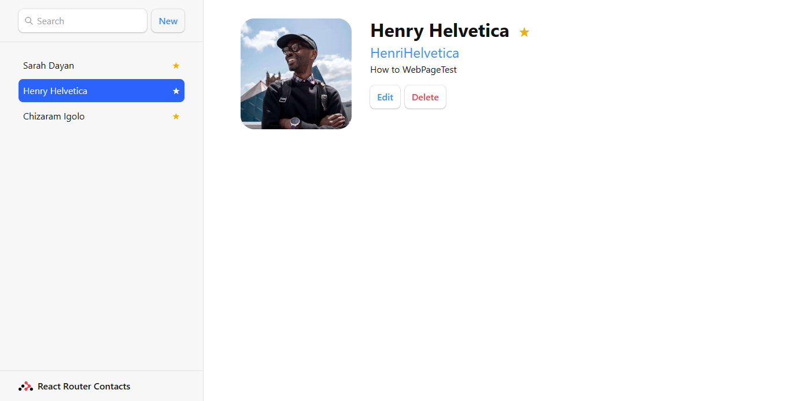

[![Contributors][contributors-shield]][contributors-url]
[![Forks][forks-shield]][forks-url]
[![Stargazers][stars-shield]][stars-url]
[![Issues][issues-shield]][issues-url]
[![LinkedIn][linkedin-shield]][linkedin-url]

<!-- PROJECT LOGO -->
<br />
<div align="center">
  <h3 align="center">React Router Navigation & Follow Along Clone-a-Web-App Tutorial</h3>

  <p align="center">
    StackTrek Quiz
    <br />
    <!-- <a href="https://recipe-page-eta.vercel.app/"><strong>See Live Version »</strong></a> -->
    <!-- <br /> -->
    <br />
    <!-- <a href="https://recipe-page-eta.vercel.app/">View Demo</a> -->
    <!-- · -->
    <a href="https://github.com/Chizaram-Igolo/contact-list/issues">Report Bug</a>
    ·
    <a href="https://github.com/Chizaram-Igolo/contact-list/issues">Request Feature</a>
  </p>
</div>

<!-- TABLE OF CONTENTS -->
  <p>Table of Contents</p>
  <ol>
    <li>
      <a href="#about-the-project">About The Project</a>
      <ul>
        <li><a href="#built-with">Built With</a></li> 
        <li>
          <a href="#how-react-router-works">How React Router Works</a>
          <ul>
            <li><a href="#basic-routing">Basic Routing</a></li>
            <li><a href="#prerequisites">CRUD Operations</a></li>
          </ul>
        </li>
      </ul>
    </li>
    <li>
      <a href="#getting-started">Getting Started</a>
      <ul>
        <li><a href="#prerequisites">Prerequisites</a></li>
        <li><a href="#installation">Installation</a></li>
      </ul>
    </li>
    <!-- <li><a href="#screenshots">Screenshots</a></li>  -->
  </ol>

<!-- ABOUT THE PROJECT -->

## About The Project

<!--  -->

A small but feature-rich app that lets you keep track of your contacts as found here: https://reactrouter.com/en/main/start/tutorial.

<div align="center">
  
</div>

## Built With

- [![React][React.js]][React-url]
- [![Vite][Vite]][Vite-url]
- [![TypeScript][TypeScript]][TypeScript-url]
- [![TailwindCSS][TailwindCss]][TailwindCSS-url]

<!-- GETTING STARTED -->

## How React Router Works

In addition to basic routing, React Router comes with functionality that let you carry out CRUD operations on the client side.

### Basic Routing

React Router defines route in a declarative way (i.e the same way you write React components or declare and define a JavaScript object).

This can be done in two (2) ways:

- **A Route Config Object:**

```js
const router = createBrowserRouter([
  {
    path: "/",
    element: <Home />
  },
  {
    path: "/about",
    element: <About />
  },
  {
    path: "/some-other-component",
    element: <SomeOtherComponent>
  }
  ...
]);
```

- **JSX Routes:**

The more preferred method by many:

```js
<Routes>
  <Route path="/" component={<Home />}>
  ...
</Routes>
```

### CRUD Operations

If you think about it, navigating to a route and fetching data from an API go hand in hand for pages that need to pull data from a server like say, you guessed it, a contact list application!

If you are going to build an application that fetches data from a server database through an API endpoint, you're likely going to want to write or update or even delete data in the database through other endpoints.

The team behind React Router thought it befitting to provide two (2) clever pieces of technology to help with these all too familiar CRUD operations known as a `loader` and an `action`.

A **loader** is a function that you write which makes a request for data for your page while an **action** is both a function you write to write or delete data and a route that your `<Form />` component, also provided by React Router, sends its `formData`. `formData` is what a vanilla HTML form sends to the path specified in the `action` attribute when it is submitted - this is standard web technology.

I have placed all the loaders and actions in `./src/utils/functions.ts` (with namiming convention; `{component}Loader/Action` to distinguish loaders and actions from one another) just to have them all in one place.

Mapping them to the **CRUD** operations, starting with **Read**, they would be:

**Read**

```ts
// ./src/utils/functions.ts

// `Request` is a standard type as defined by web 2.0 specifications
export async function rootLoader({ request }: { request: Request }) {
  const url = new URL(request.url);
  const q = url.searchParams.get("q");
  const contacts = await getContacts(q || "");
  return { contacts, q };
}
```

The `<Root />` component can use this loader:

```ts
// ./src/routes/root.tsx

export default function Root() {
  const { contacts, q } = useLoaderData() as Awaited<ReturnType<typeof rootLoader>>;
  ...
}
```

Because in the route config object, we have specified it to be the loader for this component when its route is visited:

```ts
// ./src/main.tsx

import { createBrowserRouter, RouterProvider } from "react-router-dom";

import {
  rootLoader,
  ...
} from "./utils/functions";

const router = createBrowserRouter([
  {
    path: "/",
    element: <Root />,
    loader: rootLoader,
    action: rootAction,
    errorElement: <ErrorPage />,
    children: [
      ...
    ],
  },
]);
```

## Getting Started

To get a local copy up and running follow these simple example steps.

### Prerequisites

You need to have `npm` installed on your computer in order to be able to install and run the project.

- npm
  ```sh
  npm install npm@latest -g
  ```

### Installation

1. Clone the repo
   ```sh
   git clone https://github.com/Chizaram-Igolo/contact-list.git
   ```
2. Install NPM packages
   ```sh
   cd contact-list && npm install
   ```
3. Run the Project
   ```sh
   npm run dev
   ```
4. Navigate to `http://127.0.0.1:5173/` (or the exposed port) on your favourite browser

<br/>

<!-- MARKDOWN LINKS & IMAGES -->
<!-- https://www.markdownguide.org/basic-syntax/#reference-style-links -->

[contributors-shield]: https://img.shields.io/github/contributors/Chizaram-Igolo/contact-list.svg?style=for-the-badge
[contributors-url]: https://github.com/Chizaram-Igolo/contact-list/graphs/contributors
[forks-shield]: https://img.shields.io/github/forks/Chizaram-Igolo/contact-list.svg?style=for-the-badge
[forks-url]: https://github.com/Chizaram-Igolo/contact-list/network/members
[stars-shield]: https://img.shields.io/github/stars/Chizaram-Igolo/contact-list.svg?style=for-the-badge
[stars-url]: https://github.com/Chizaram-Igolo/contact-list/stargazers
[issues-shield]: https://img.shields.io/github/issues/Chizaram-Igolo/contact-list.svg?style=for-the-badge
[issues-url]: https://github.com/Chizaram-Igolo/contact-list/issues
[linkedin-shield]: https://img.shields.io/badge/-LinkedIn-black.svg?style=for-the-badge&logo=linkedin&colorB=555
[linkedin-url]: https://linkedin.com/in/emmanueligolo
[React.js]: https://img.shields.io/badge/React-20232A?style=for-the-badge&logo=react&logoColor=61DAFB
[React-url]: https://reactjs.org/
[Vite]: https://img.shields.io/badge/vite-%23646CFF.svg?style=for-the-badge&logo=vite&logoColor=white
[Vite-url]: https://vitejs.dev/
[TypeScript]: https://img.shields.io/badge/typescript-%23007ACC.svg?style=for-the-badge&logo=typescript&logoColor=white
[TypeScript-url]: https://www.typescriptlang.org/
[TailwindCSS]: https://img.shields.io/badge/tailwindcss-%2338BDF8.svg?style=for-the-badge&logo=tailwind-css&logoColor=white
[TailwindCSS-url]: https://tailwindcss.com/
